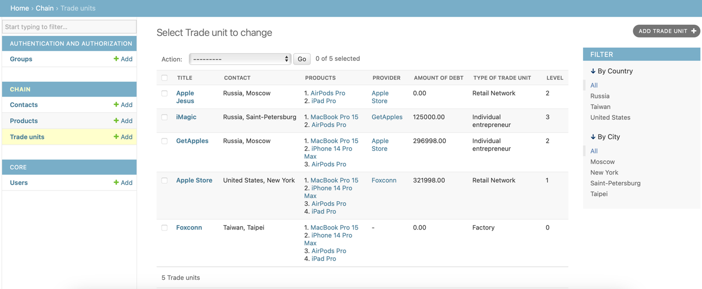

# Retail Network app
This is a simple application that allows you to manage your retail network
## Main features
* Retail Network CRUD.
* Customized admin panel.
* Only active and authenticated user have permissions to API.
* City filter by API request.
* Country filter in admin panel.
* Provider link in admin panel.
* Reset debt by admin action.
* Disabled 'debt' update by API request.
## Technology stack   
Python v.3.11     
Poetry v.1.4.1   
Django v.4.2.1  
Django REST Framework v.3.14.0   
PostgreSQL    
Docker  
Docker-compose   
OpenAPI documentation
## Local start  
Create local .env file with the next data:  
``` python
SECRET_KEY='your django key'
DATABASE_URL=postgres://postgres:postgres@db/trading_network
DEBUG=False
```
Run API, DB and Migrations containers by:
``` python
docker-compose up --build
```
You can send requests to API by http://localhost:8000
## Admin manage
* Open docker desktop and enter API container terminal   
* Create superuser in API container terminal by:
``` python
./manage.py createsuperuser
```
Authenticate superuser in Django Admin panel by link:
http://localhost:8000/admin/   
Example of customized admin panel, where you can see hierarchy level of any link in your trading network 

## OpenAPI documentation
You can open API documentation by GET request to the API container:   
- http://localhost:8000/schema/redoc/
